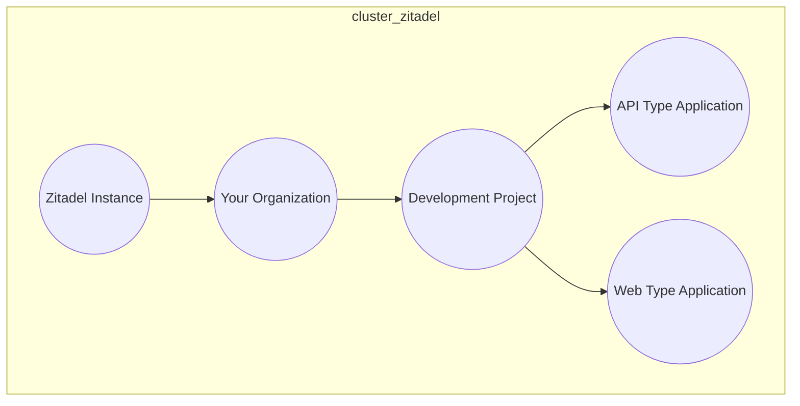

# zitadel-nodejs-nestjs

Welcome to the `zitadel-nodejs-nestjs` repository! This example NestJs application demonstrates how to implement authentication using the Zitadel OIDC (OpenID Connect) flow with the help of Passport. Please note that this example exclusively focuses on authentication and does not include authorization.

## Table of Contents

- [Introduction](#introduction)
- [Getting Started](#getting-started)
  - [Prerequisites](#prerequisites)
  - [Installation](#installation)
- [Usage](#usage)
- [Contributing](#contributing)
- [License](#license)

## Introduction

[Zitadel](https://zitadel.ch/) is a comprehensive Identity and Access Management (IAM) solution that offers robust authentication and authorization capabilities. This example application showcases how to leverage Zitadel for authentication within a NestJs application.

:warning: Please be aware that this example only deals with authentication and does not cover the authorization aspect of your application.

## Getting Started

Follow these steps to set up and run the `zitadel-nodejs-nestjs` application on your local machine.

### Prerequisites

Before you begin, ensure you have the following prerequisites in place:

- Node.js and npm installed on your system
- Yarn package manager installed (you can install it with `npm install -g yarn`)
- Basic knowledge of NestJs, Passport, and OIDC authentication
- A Zitadel account and OIDC client credentials (client ID and client secret)

Your Zitadel should be configured to look like this:



### Installation

1. Clone the repository:

   ```shell
   git clone https://github.com/ehwplus/zitadel-nodejs-nestjs.git
   cd zitadel-nodejs-nestjs
   ```

   Install the project dependencies using Yarn:

   ```shell
   yarn install
   ```

2. Create a .env file in the project root. You can use the provided .env.example file as a template and set the following environment variables:

   ```
   APP_PORT=8080
   NODE_ENV="development"

   OPENAPI_CLIENT_ID=
   OPENAPI_CLIENT_SECRET=

   IDP_AUTHORITY=
   IDP_AUTHORIZATION_TYPE=
   IDP_AUTHORIZATION_PROFILE_TYPE=
   IDP_AUTHORIZATION_PROFILE_KEY_ID=
   IDP_AUTHORIZATION_PROFILE_KEY=
   IDP_AUTHORIZATION_PROFILE_APP_ID=
   IDP_AUTHORIZATION_PROFILE_CLIENT_ID=
   ```

3. Replace the values as needed, especially the Zitadel OIDC client credentials and issuer URL.

4. Start the application:
   ```shell
   yarn start
   ```

Your zitadel-nodejs-nestjs application should now be up and running, configured to use Zitadel OIDC authentication.

## Usage

This example demonstrates the basic setup for integrating Zitadel OIDC authentication into a NestJs application. It showcases the login flow and user authentication. However, remember that this project doesn't cover authorization, and you should implement your own authorization logic according to your application's needs.

Feel free to explore, modify, and extend the code to meet your specific requirements.

## Contributing

We welcome contributions from the community. If you find issues or have ideas for improvements, please open an issue or submit a pull request. Your input is highly valued.

We unfortunately neither have a CONTRIBUTING.md nor have the resources to provide a helpful CONTRIBUTING.md.

<!-- For more information on contributing, please check the CONTRIBUTING.md file. -->

## License

This project is licensed under the MIT License. You are free to use, modify, and distribute the code as per the terms specified in the license.
